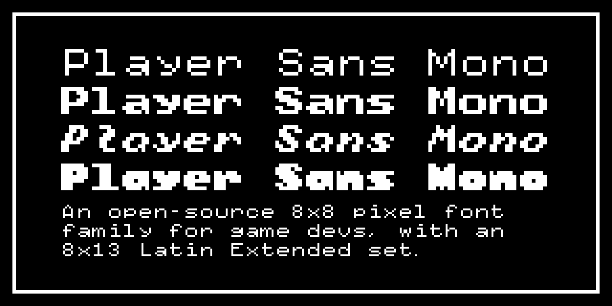

Player Sans Mono (pre-release 2021-08-21)
=========================================

An open-source/libre typeface family designed for video game developers.

Features
--------

- Monospaced 8×8 (Latin English) and 8×13 (Latin Extended) character sets
- Light, Classic, Italic and Bold styles
- Extensive set of font formats (`.otf`/`.ttf`/`.woff`/`.woff2`)
- Source files (`.glyphs` and `.ufo` format) so you can contribute or make your own edits

Usage/Installation
------------------

This package includes `.otf` and `.ttf` desktop fonts which you can install on your system and import into many game engines. Web fonts are also included in `.woff` and `.woff2` formats for use on the web and in browser-based game engines.

Use the `.otf` files first (they're smaller and usually render better), and `.ttf` as a backup if your engine doesn't support `.otf` fonts.

Converting to bitmap font formats
---------------------------------

Some game engines require bitmap fonts, typically in the BMFont format. The BMFont format comes in a variety of forms, usually a `.png` image (or a sequence of images) and a data file (`.txt`, `.xml`, `.bin`, or `.json`).

You can generate these files via the original [BMFont for Windows](https://www.angelcode.com/products/bmfont/) by AngelCode, but it doesn't always give perfect pixel-for-pixel results when converting pixel fonts. Instead, I would recommend the cross-platform command line tool [fontbm](https://github.com/vladimirgamalyan/fontbm), which has been 100% accurate in my tests so far.

Future
------

- More build formats for more game engine support
- Build scripts
- Extend character set further
- Proportional-width styles

License
-------

This typeface is released under the [SIL Open Font License 1.1](https://scripts.sil.org/OFL)

Questions and contributions
---------------------------

Email: justin@justinpenner.ca
Repo: https://github.com/justinpenner/player-sans-mono/